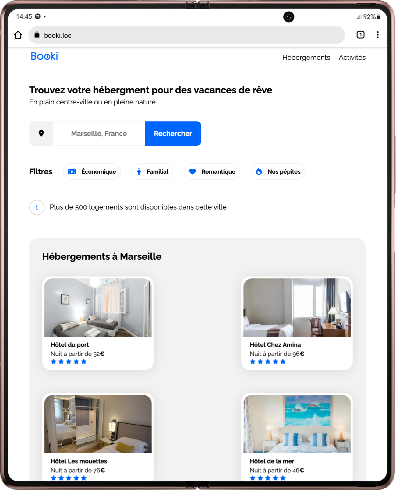

# Booki

***
"Portail de Recherches pour Hébergements et Activités Urbaines***  
***L’entreprise souhaite développer un site Internet qui permette aux usagers de trouver des hébergements et des activités dans la ville de leur choix."
***

### Mise en place de l'environnement de développement

- Installer et configurer mon éditeur de code Visual Studio Code.
- Mettre en place un serveur local pour le développement PHP/WordPress (j'utilise MAMP Pro sur iMac).
- Création d'une nouvelle structure de projet.

### Découpe de la maquette HTML

1. **Analyse de la maquette :**
   - Identifier tous les éléments visibles sur la maquette comme le logo, la barre de recherche, les sections d'hébergement et d'activités, etc.
   - Regrouper les éléments similaires en fonction de leur disposition (horizontale ou verticale).
   - Associer chaque élément à sa balise HTML appropriée (par exemple, un logo sera généralement dans une balise ``).

2. **Disposition horizontale vs verticale :**
   - Détermine quand positionner les éléments horizontalement ou verticalement.
   - Vérifier que chaque bloc de la maquette est structuré de manière logique et conforme aux principes de design web.

### Intégration du code de l'en-tête de la page
   - Encapsuler l'en-tête de la page.
   - Intégration de la barre de navigation principale.
   - Appliquer Flexbox ou Grid pour aligner le logo Booki et les sections Hébergements/Activités selon les spécifications de la maquette.
   - Intégrer la bordure bleue qui s'affiche au survol des éléments spécifiques.
   - Privilégier l'utilisation de pixels plutôt que des pourcentages pour assurer une mise en page stable et prévisible.

### Intégration du formulaire de recherche
   - Analyser la maquette pour identifier les trois parties distinctes du formulaire de recherche.
   - Utiliser les balises HTML appropriées comme <form>, <input>, <button>, et éventuellement <label> pour une accessibilité améliorée.
   - Utiliser les styles CSS pour mettre en forme les différents éléments du formulaire selon les spécifications visuelles (tailles, couleurs, espacements).

### Réalisation de la partie Filtre
   - Utiliser Flexbox pour positionner et aligner les éléments des filtres selon la disposition définie sur la maquette Booki.
   - Intégrer les filtres sans prendre en compte les changements d'apparence au survol.
   - Implémenter le changement de couleur de fond ou d'autres styles spécifiés pour le survol des éléments.

### Intégration de la première carte d'hébergement

1. **Création de la carte d'hébergement :**
   - S'inspirer des cartes déjà intégrées pour "les plus populaires", mais ajuster l'alignement des éléments pour correspondre aux spécifications des cartes d'hébergement (alignement vertical).
   - Utiliser les balises HTML appropriées (comme `
` pour la carte et `` pour l'image de l'hébergement).

2. **Gestion des images :**
   - Vérifier de définir une largeur en pourcentage (%) pour l'image, suivie d'une hauteur en pixels (px) pour éviter les distorsions.
   - Utiliser la propriété CSS `object-fit` pour contrôler comment l'image est ajustée dans son conteneur sans déformer sa proportion.

### Réalisation de la première "card" pour "Hébergements à Marseille"

1. **Intégration de la première "card" :**
   - Utiliser les balises HTML appropriées pour structurer la "card" selon la maquette fournie.
   - Vérifier que le contenu de la "card" inclut le titre, une icône représentative et le lien "Afficher plus".

2. **Duplication des "cards" :**
   - Dupliquer la première "card" réalisée pour obtenir un total de 6 "cards" comme spécifié dans la maquette.
   - Vérifier de conserver la structure et les styles appliqués à la première "card".

3. **Mise en page avec Flexbox :**
   - Utiliser Flexbox pour organiser les "cards" en grille selon les spécifications de la maquette.
   - Définis les largeurs des "cards" en pourcentage (%) pour maintenir une mise en page flexible et responsive.

4. **Remplacement du contenu :**
   - Remplace le contenu des différentes "cards" dupliquées par celui spécifié dans la maquette pour "Hébergements à Marseille".

### Intégration de la section "Activités à Marseille"

1. **Intégration de la section :**
   - Utiliser Flexbox ou Grid pour organiser et aligner les éléments de la section "Activités à Marseille" selon les spécifications de la maquette.
   - Vérifier d'identifier et de structurer correctement les différents éléments et blocs de cette section en fonction du découpage de la maquette.

### Réalisation du footer

1. **Structure du footer :**
   - Utiliser la balise `<footer>` pour encapsuler le contenu du pied de page.
   - Organiser les éléments du footer tels que les liens, les informations de contact, et autres sections pertinentes.

2. **Stylisation et contenu :**
   - Appliquer les styles CSS appropriés pour aligner et mettre en forme les éléments du footer selon les standards de conception de ton projet.
   - Vérifier que le contenu du footer est complet et inclus toutes les informations nécessaires comme les mentions légales, les liens vers les réseaux sociaux, etc.

### Vérification avec les validateurs W3C

1. **Validation HTML :**
   - Utiliser le [validateur HTML du W3C](https://validator.w3.org/) pour vérifier le code HTML respecte les normes et ne contient pas d'erreurs syntaxiques.
   - Vérifier que toutes les balises sont correctement ouvertes et fermées, et que les attributs sont utilisés de manière appropriée.

2. **Validation CSS :**
   - Utilise le [validateur CSS du W3C](https://jigsaw.w3.org/css-validator/) pour vérifier le code CSS est valide et ne contient pas d'erreurs.
   - Vérifier que toutes les propriétés CSS sont correctement écrites et supportées par les navigateurs.

### Version desktop fonctionnelle

1. **Définition des largeurs maximale et minimale :**
   - Définir une largeur maximale à 1440px en utilisant des unités appropriées en CSS (comme `max-width`).
   - Vérifier d'avoir une largeur minimale de 1024px pour garantir que le site est optimisé pour les écrans de taille moyenne à grande.

2. **Gestion des résolutions :**
  - Utiliser des media queries pour ajuster la mise en page et les styles CSS en fonction des résolutions spécifiées (1024px à 1440px).
  - Vérifier que le contenu principal reste centré et lisible sur les écrans plus larges (au-dessus de 1440px) en utilisant des marges automatiques ou des méthodes similaires.

3. **Vérification des incohérences :**
  - Tester le comportement du site à différentes résolutions telles que 1024px, 1440px et les résolutions intermédiaires pour détecter et corriger d'éventuelles incohérences.
  - Vérifier que le contenu s'adapte de manière fluide sans pertes de lisibilité ou de fonctionnalité sur les différentes résolutions desktop.

#### Découvrir le projet Booki en ligne
🔗 [Booki](https://jean-assoumani.github.io/booki/)

<em>Projet 3 - Créez la page d'accueil d'une agence de voyage avec HTML & CSS - Openclassrooms 2024</em>
